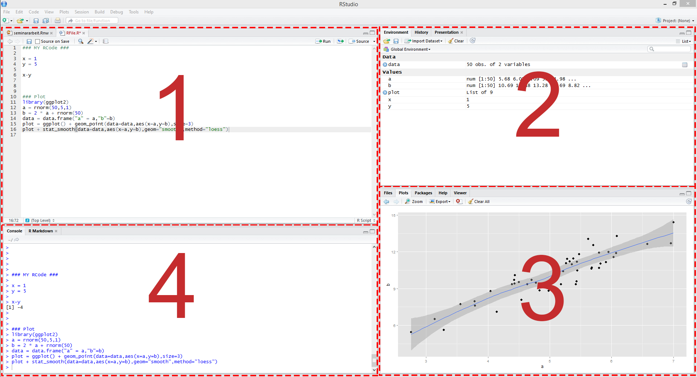

# The first steps in R

## RStudio for the first time

I highly recommend to install RStudio. For installation just follow the instructions on  
[https://rstudio.com/products/rstudio/download/#download](https://rstudio.com/products/rstudio/download/#download) 

When you open RStudio, it is typically split in 4 panels as you can see in the figure below:


Figure 1: Illustration of RStudio

These panels show:

1. Your script file, which is an ordinary text file with suffix ".R". For instance, yourFavoritFileName.R. This file contains your code.
2. All objects we have defined in the environment.
3. Help files and plots.
4. The console, which allows you to type commands and display results.

Some other terms that will be useful:

- Working directory: The file-directory you are working in. Useful commands: with *getwd()* you get the location of your current working directory and *setwd()* allows you to set a new 
  location for it. This is very useful when you would like to load or save several files. You can just set your working directory globally and all files can be loaded or will be saved 
  into this directory.
- Workspace: This is a hidden file (stored in the working directory), where all objects you use (e.g., data, matrices, vectors, variables, functions, etc.) are stored. Useful commands: 
  *ls()* shows all elements in our current workspace and *rm(list=ls())* deletes all elements in our current workspace. It is also possible to remove only some objects with 
  *rm(object1, object2)*. 


## Simple calculations

We start with a very basic calculation. Let's type *1+1* into the console window and press enter. We get
```{r}
 1+1 # first calculation
```

i.e. the result of the calculation is returned. 

Note that everything that is written after the #-sign is ignored by R, which is very useful to comment your code. The second window above, starting with ##, shows the output.


Let's consider a second calculation
```{r, error = TRUE }
1+2+3+ # second calculation
```
This calculation ended with an error. The reason is that the command can only processed if entered correctly.


```{r, error = TRUE }
1+2+3+4 # second calculation
```

A similar thing happens when parentheses are not closed. 


```{r, error = TRUE }
 2*(2+3
```

It will be helpful to use a script file, such as yourFavoritFileName.R, to store your R commands. Otherwise, you would have to type your code again when an error occurred. You can send single lines or marked regions of your R-code to the console by pressing the keys **STRG+ENTER**.

## Assigments and matrix algebra

The **assignment** operator will be your most often used tool. Here is an example where a **scalar** variable is created:

```{r, error = TRUE }
x <- 9
x
x+1
```
Note: The `<-` assignment operator is an unusual syntax that you do not find in other programming languages. In many cases you can alternatively use the `=` operator. Typical R style uses the `<-` assignment operator due to some more in depth-differences and compatibility with older version of R. More on R style recommendations can be found in the [tidyverse style guide](https://style.tidyverse.org/). In simple settings, alternatives to `<-` are    

```{r, error = TRUE }
x = 9
x
```
or even 
```{r, error = TRUE }
4 -> y # possible but unusal
y
```

We consider now a vector, an object you will use frequently:

```{r, error = TRUE }
z <- c(1,3,5,6)
z
```

As discussed, `ls()` states the content of the workspace, whereas `rm(list =ls())` deletes the workspace.
```{r, error = TRUE }
ls()
rm(list=ls())
ls()

```

In the next step we will consider some vector multiplication. There are three different ways to multiply a vector, namely element by element, using the inner product, or using the outer product. Element by element gives you a vector of the same dimension.


```{r, error = TRUE }
z <- c(1,3,5,6)
z*z                #multiplication element by element
```

The function `t()` gives the transpose of a vector (or matrix). It is therefore tempting to calculate the inner product as
```{r, error = TRUE }
t(z)*z                #multiplication inner product
```
but this does not give the desired answer. Insead, you have to use
```{r, error = TRUE }
z <- c(1,3,5,6)
t(z)%*%z                #multiplication inner product
```

Note that R stores z<sup>T</sup>z as a matrix.
```{r, error = TRUE }
class(t(z)%*%z)
class(z)
```

Finally, we have the outer product that gives us a matrix
```{r, error = TRUE }
z <- c(1,3,5,6)
z%*%t(z)                #multiplication outer product
```


In general, be very careful with `%*%` versus `*`. They are often both feasible, but yield different results!

You can also multiply a vector with a scalar:
```{r, error = TRUE }
z*4
```

A strength of R is that operations can be conducted for each element of the vector in one statement

```{r, error = TRUE }
z^2
log(z)

(z-mean(z))/sd(z)
```


So far, we have seen the function `c()` that can be used to combine objects. All function calls use the same general notation: a function name is always followed by round parentheses. Sometimes, the parentheses include arguments, such as
```{r, error = TRUE }
z <- seq(from = 1, to = 5, by = 1)
z
```

With square brackets you can access particular elements, such as 

```{r, error = TRUE }
z[1:3]                  #refer to particular elements
```


We will next define a matrix and perform matrix-vector multiplication.

```{r, error = TRUE }
M <- matrix(data=1:9, nrow=3, ncol=3)    # define matrix M
M
dim(M)                                  # dimension of M
dim(z)                                  # dimension of z - does not work because z is not a matrix
length(z)                               # number of elements of z
```

Element-by-element multiplication for M is given by
```{r, error = TRUE }
M * M
```
Standard matrix multiplication is again done using `%*%` such as
```{r, error = TRUE }
M %*% M
```
```{r, error = TRUE }
t(M) %*% M
```
If matrices and vectors have suitable dimensions, you can multiply them as follows:
```{r, error = TRUE }
M %*% z[1:3]
```

Similar to before, with  square brackets you can excess particular elements, such as 

```{r, error = TRUE }
M[,3]                 # state the third column of M
M[3,3]                # state element in the third column and third row of M
```

Here are some more examples:
```{r, eval=FALSE}
M[,1]                 # first column of M
M[3,3]                # element in the third column and third row of M
z[c(1,4)]             # first and fourth element of z
```


*Logical* statements are also very useful. For example, if you want to know which elements in the first column of matrix `M` are strictly greater than 2:
```{r}
# See which elements:
M[,1]>2
# and extract the elements
M[M[,1]>2,1]
```
Note: Logical operations return so-called *boolean* objects, i.e., either a `TRUE` or a `FALSE`. For instance, if we ask R whether `1>2` we get the answer `FALSE`.


## Operators


We have alrady seen basic arithmetic operations such as  
```{r, error = TRUE ,eval=F}
+, -, *, /
  
```  
  


Decimals are declared with a ".", not a comma

```{r, error = TRUE ,eval=F}
1.8 not 1,8
```

Exponents are declared with ^, i.e. $2^3$ is written as  
```{r, error = TRUE ,eval=F}
2^3
```

For mathematical calculations, only parentheses `()` can be used. 


Frequently used mathematical functions are

```{r, error = TRUE,eval=F }
sqrt()            # square root
exp()             # exponential function
log()             # nat.  Logarithm
log(...,10)       # Logarithm with Base 10
abs()             # absolute value
round(...,x)      # rounding to x decimals.
pi 
exp(1)            # Eulers number
sin(),cos(),tan() # trigonemetric functions
min(), max()      # returns the lowest/highest value of a vector/matrix
```


Asa few examples enter the following calculations and make sure to understand the commands:

```{r, error = TRUE,eval=F }
 1.8+2
 1.8-2
 1.8*2
 1.8/2
 2+2*3
 (2+2)*3
 2^3
 8^(1/3)
 3^2
 9^0.5
 2^2*2+2
 2^(2*((0.2+0.3)*(1+2)))+4
 sqrt(2)
 exp(1)
 exp(2)
 log(7.389056)
 log(exp(3))
 log(100,10)
 abs(1.8-2)
 round(sqrt(2),2)
 round(sqrt(2),4)
 pi
 sin(pi/2)
 sin(pi/2)
 sin(pi)
 tan(pi)
 x=2+3i
 y=4+1i
 x
 y
 x+y
 x*y
```

Attention: 

```{r, error = TRUE,eval=F }
 1.224606e-16
```
is interpreted as $1.224606 \times 10^{-16}$. This is often exactly zero, but for internal memory purposes (R uses double-precision floating-point numbers and therefore only has up to 16 decimals), can be a rounding mistake. 


## Further data objects

Besides classical data objects such as scalars, vectors, and matrices there are three further data objects in R:

1.The **array**: A matrix but with more dimensions. Here is an example of a 2×2×2-dimensional array

```{r, error = TRUE }
myFirst.Array <- array(c(1:8), dim=c(2,2,2))
```

2. The **list**: In `lists` you can organize different kinds of data. E.g., consider the following example:


```{r, error = TRUE }
myFirst.List <- list("Some_Numbers" = c(66, 76, 55, 12, 4, 66, 8, 99), 
                     "Animals"      = c("Rabbit", "Cat", "Elefant"),
                     "My_Series"    = c(30:1)) 
```


3. The **data frame**: A `data.frame` is a `list`-object but with some more formal restrictions (e.g., equal number of rows for all columns). As indicated by its name, a `data.frame`-object is designed to store data:


```{r, error = TRUE }
myFirst.Dataframe <- data.frame("Credit_Default"   = c( 0, 0, 1, 0, 1, 1), 
                                "Age"              = c(35,41,55,36,44,26), 
                                "Loan_in_1000_EUR" = c(55,65,23,12,98,76)) 
```

## R help


There exist help files for all commands in R. For example consider the help file of the function *sum()*. You can access the help file with
```{r, error = TRUE }
?sum
```

The file usually contains the categories: Description, Usage, Arguments, Details, Value and References.


After the general description follows the syntax of the command. This usually indicates which (optional) arguments the command allows. Then follows `na.rm`, which indicates whether missing values (na) will be removed (rm). The default is `FALSE`.


```{r, error = TRUE }
 x<-c(1,2,NA,4,5)
 x
sum(x)
sum(x,na.rm=T)
```

Details describes the exact calculation (trivial in this case), and some command specific characteristics. Value describes what is returned, in the case of `sum()` it is obviously a sum of numbers, given that numeric data was used as an input. 


## R packages

There are tons of R packages that are useful for different aspects of data analysis. Some packages that can help you make beautiful plots and that you might want check out are the package *ggplot2* and the collection of packages *tidyverse*.
You can install the packages with *install.package(packagename)*. In order to use the package type *library(package)*. The package has to be installed only once, but you have to load the package with *library(package)* every time you want to use it.


## Exercises I

**Exercise 1:** 

Try to shorten the notation of the following vectors as much as possible, using `:` notation:

a. `x <- c(157, 158, 159, 160, 161, 162, 163, 164)`
b. `x <- c(10, 9, 8, 7, 6, 5, 4, 3, 2, 1)`
c. `x <- c(-1071, -1072, -1073, -1074, -1075, -1074, -1073, -1072, -1071)`


**Exercise 2:** 

The ´:´ operator can be used in more complex operations along with arithmetic operators, and variable names. Have a look at the following expressions, and write down what sequence you think they will generate. Then check with R.

a. `(10:20) * 2`
b. `105:(30 * 3)`
c. `10:20*2`
d. `1 + 1:10/10`
e. `2^(0:5)`


**Exercise 3:** 

R has several functions for rounding. Let’s start with floor, ceiling, and trunc:

`floor(x)` rounds to the largest integer not greater than `x`
`ceiling(x)` rounds to the smallest integer not less than `x`
`trunc(x)` returns the integer part of `x`

Below you will find a series of arguments (x), and results (y), that can be obtained by choosing one or more of the 3 functions above (e.g.`y <- floor(x)`). Which of the above 3 functions could have been used in each case? First, choose your answer without using R, then check with R.

a. `x <- c(300.99, 1.6, 583, 42.10)`

   `y <- c(300, 1, 583, 42)`
   
b. `x <- c(152.34, 1940.63, 1.0001, -2.4, sqrt(26))`

   `y <- c(152, 1940, 1, -2, 5)`
   
c. `x <- -c(3.2, 444.35, 1/9, 100)`

   `y <- c(-3, -444, 0, -100)`

d. `x <- c(35.6, 670, -5.4, 3^3)`

   `y <- c(36, 670, -5, 27)`
   
   
**Exercise 4:**    
   
Consider the following vectors:

`u <- c(5, 6, 7)`

`v <- c(2, 3, 4)`

Perform the following operations:

* Add `u` and `v`
* subtract `v` from `u`
* multiply `u` by `v` element by element
* divide `u` by `v` element by element
* calculate the inner product of `u` and `v`
* calculate the outer product of `u` and `v`
* raise `u` to the power of `v` element by element

Then check your answer with R.

 
 
 
